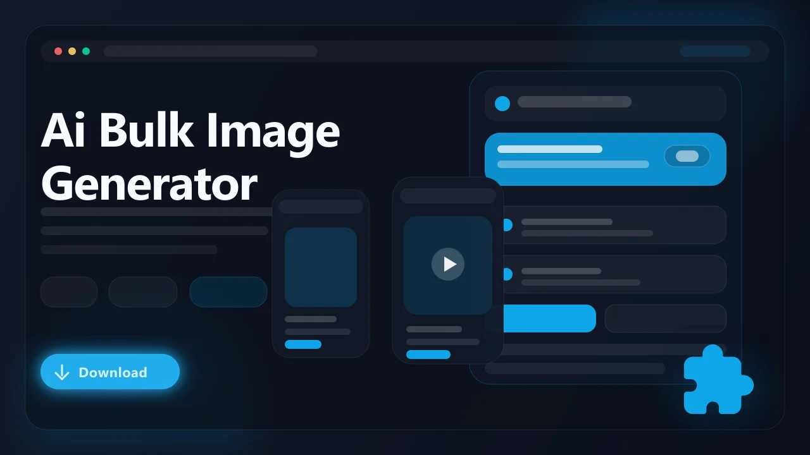

# AI Bulk Image Generator — Coming Soon (Browser Extension)

> Generate multiple AI images from text prompts directly in your browser, then download them all at once. **This extension is currently in development and has not been released yet.**

AI Bulk Image Generator is an upcoming browser extension that will let users produce large batches of AI-generated images without leaving the browser. Instead of running prompts one at a time through separate platforms, you will be able to queue dozens of text prompts, select a model, and export every result in a single session. It is being built as a creative and productivity tool for anyone who needs AI imagery at scale.

- Create batches of AI-generated images from a list of text prompts
- Queue multiple prompts and generate them in sequence or parallel
- Download all generated images at once as individual files or a ZIP archive
- Choose from supported AI image models directly in the extension popup
- Designed for Chrome, Edge, Brave, Opera, Firefox, and other Chromium browsers

## Status

**This extension is not yet available for download.** Development is in progress and a release date has not been announced. Sign up below to get notified when it launches.

:bell: **Get notified when this launches:** [Join the waitlist](https://serp.ly/coming-soon-extensions)

## Links

- :hourglass_flowing_sand: Waitlist: [Coming Soon — Sign Up](https://serp.ly/coming-soon-extensions)
- :question: Help center: [SERP Help](https://help.serp.co/en/)
- :bulb: Request features: [GitHub Issues](https://github.com/serpapps/ai-bulk-image-generator/issues)

## Preview

## Table of Contents

- [Why AI Bulk Image Generator](#why-ai-bulk-image-generator)
- [Planned Features](#planned-features)
- [How It Will Work](#how-it-will-work)
- [Expected Formats](#expected-formats)
- [Who It's For](#who-its-for)
- [Use Cases We're Building For](#use-cases-were-building-for)
- [FAQ](#faq)
- [License](#license)
- [Notes](#notes)
- [About AI Image Generation](#about-ai-image-generation)

## Why AI Bulk Image Generator

Most AI image generation platforms are designed around a single-prompt workflow. You type one prompt, wait for one result, then start over. When a project calls for dozens or hundreds of variations, that loop becomes a bottleneck. Switching between tabs, re-entering settings, and saving files individually eats time that should go toward the creative work itself.

AI Bulk Image Generator is being designed to collapse that cycle into a single browser-based session. The goal is to accept a batch of prompts, run them against a supported AI model, and return every generated image ready for bulk download. No context-switching between tools, no manual saving one file at a time.

## Planned Features

- Batch prompt input so you can paste or type a full list of image descriptions at once
- Support for multiple AI image generation models selectable from the extension interface
- Adjustable resolution, aspect ratio, and style parameters per batch or per prompt
- Bulk download of all generated images as individual files or a single ZIP archive
- Generation queue with progress indicators for each prompt in the batch
- Prompt history and reuse so you can revisit and regenerate previous batches
- Browser-native workflow with no external software or command-line tools required
- Cross-browser compatibility targeting Chrome, Edge, Brave, and Firefox

## How It Will Work

1. Install the extension once it is released.
2. Open the extension popup from your browser toolbar.
3. Enter one or more text prompts describing the images you want to generate.
4. Select the AI model and adjust any available settings such as resolution or style.
5. Start the batch generation and monitor progress in the queue panel.
6. Review the generated images in the results gallery inside the extension.
7. Select individual images or choose all for download.
8. Export the images to your local machine as separate files or a compressed archive.

## Expected Formats

- Input: Plain text prompts entered directly or pasted as a list into the extension interface
- Output: PNG or JPEG image files, depending on the selected model and output settings

Generated images will be saved in standard formats compatible with most image editors, design tools, and content management platforms.

## Who It's For

- Content creators who need large volumes of original imagery for blogs, social media, or newsletters
- Marketers building ad variations and campaign visuals across multiple themes
- Game developers and concept artists exploring visual ideas through rapid iteration
- E-commerce sellers generating product mockups, lifestyle scenes, or listing graphics
- Educators and researchers producing illustrative material for presentations and papers

## Use Cases We're Building For

- Generate a full set of blog header images from a list of article titles
- Produce multiple ad creative variations for A/B testing across campaigns
- Create a library of concept art exploring different visual directions for a project
- Build a collection of stock-style images tailored to a specific niche or brand
- Batch-generate social media visuals for an entire content calendar in one session

## FAQ

**When will AI Bulk Image Generator be released?**
A release date has not been set. Sign up at the waitlist link above to be notified as soon as it is available.

**Which AI models will it support?**
The specific models have not been finalized. The extension is being built to support multiple image generation backends, and supported models will be announced closer to launch.

**Will there be a limit on how many images I can generate at once?**
Batch limits will depend on the selected model and any API constraints involved. Details will be shared when the extension is closer to release.

**Can I control the style or resolution of generated images?**
Yes. Adjustable parameters such as resolution, aspect ratio, and style presets are planned features, though the exact options will vary by model.

**Is it free?**
Pricing details will be announced closer to launch. SERP extensions typically include a free trial period.

**Do I need an account with an AI image platform to use it?**
Requirements will depend on the generation models integrated into the extension. Some may use built-in API access while others may require your own credentials. Full details will accompany the release.

## License

This repository is distributed under the proprietary SERP Apps license in the [LICENSE](LICENSE) file. Review that file before copying, modifying, or redistributing any part of this project.

## Notes

- This extension is in development and is not available for download yet
- Only generate and use images in accordance with the terms of service of the underlying AI models
- Output quality and style will vary depending on the selected model and prompt specificity
- AI model availability and API terms may change, which could affect supported features
- An active internet connection will be required for all image generation requests

## About AI Image Generation

AI image generation uses machine learning models trained on large visual datasets to produce original images from text descriptions. These models accept natural language prompts and return images that match the described content, style, and composition. AI Bulk Image Generator is being built to make this process faster and more practical by handling multiple prompts in a single browser-based workflow, removing the need to generate and save images one at a time.
